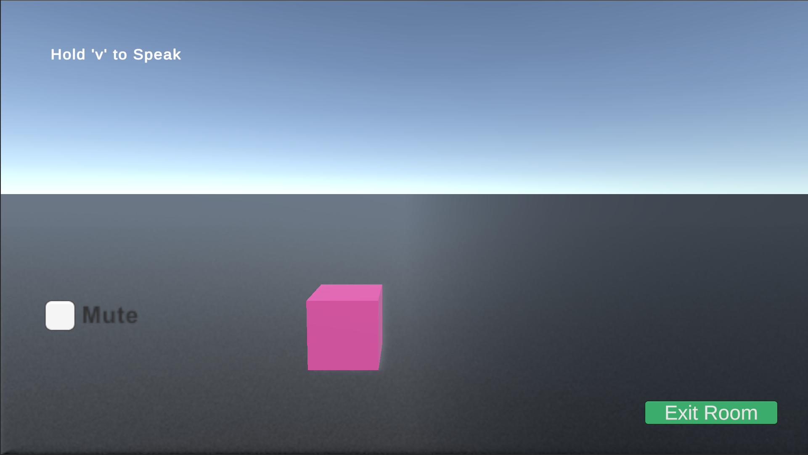

# 🌐 Multiplayer Voice Game (Photon)

> Real-time multiplayer Unity game with synchronized players and integrated voice communication.

---

## 🎥 Gameplay

  

---

## 📸 Preview

  

---

## 🧠 What I Built

* Real-time player synchronization  
* Multiplayer lobby and room system  
* Voice chat integration  

---

## 🚀 Features

* Multiplayer gameplay  
* Live player movement sync  
* Voice communication system  

---

## ⚙️ Tech Stack

  
  

---

## ▶️ How to Run

1. Clone repository  
2. Open in Unity  
3. Press Play  

---
